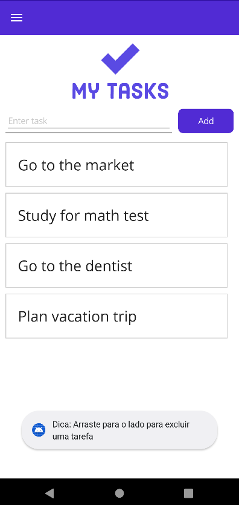
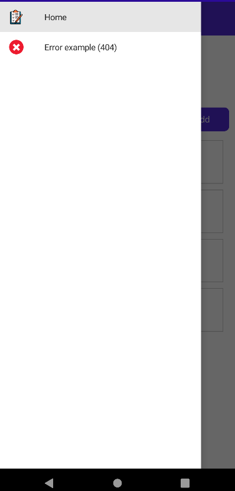
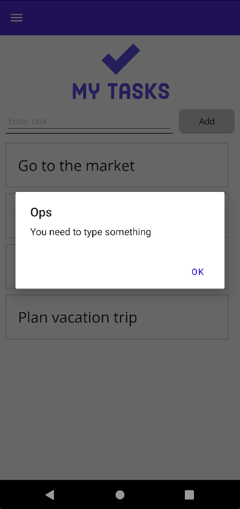
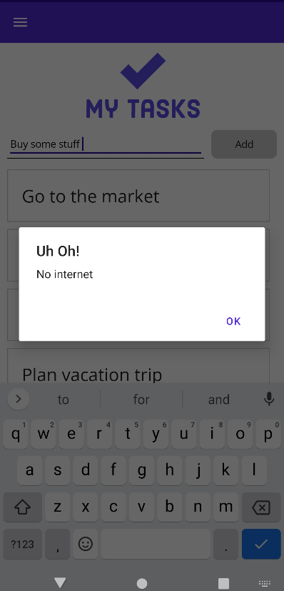
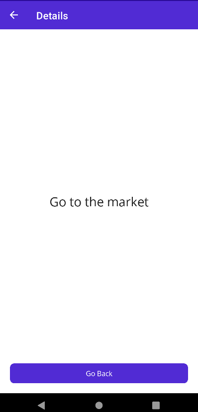
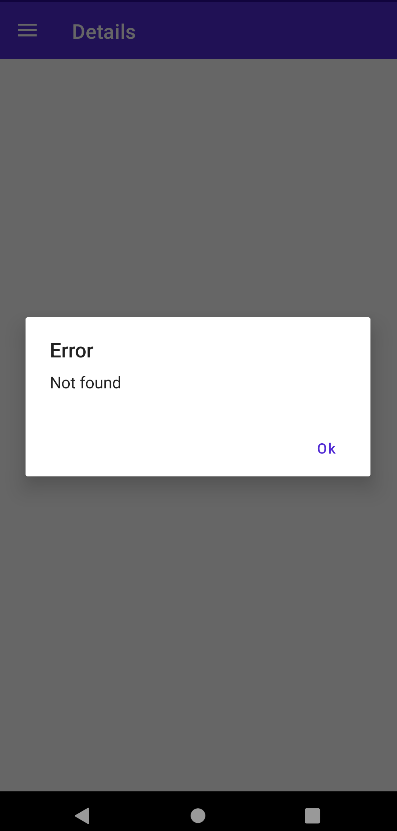
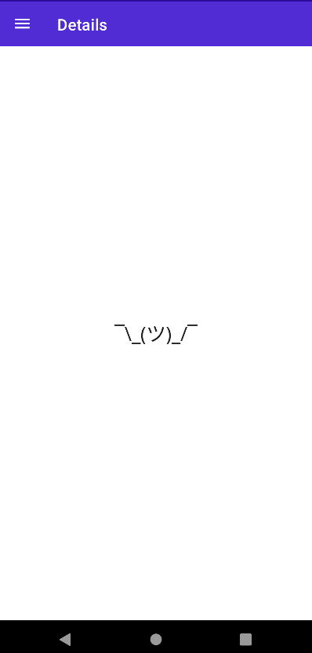

# MAUI-Tests

## Sobre o projeto

Este projeto é um teste de conceito para aprender a utilizar o MAUI. O projeto consiste em uma aplicação que permite o usuário cadastrar e visualizar uma lista de tarefas.

## O que é MAUI?

MAUI é a abreviação de .NET Multi-platform App UI, que é um framework de desenvolvimento de interfaces de usuário multiplataforma, que permite o desenvolvimento de aplicações para Android, iOS, macOS, Windows e Linux, utilizando uma única base de código. Em outras palavras, é um framework que permite o desenvolvimento de aplicações multiplataforma utilizando C# e XAML que veio para substituir o Xamarin.Forms.

## Telas da aplicação

  
(Splash Screen da aplicação)
  
---

  
(Tela inicial da aplicação)

---

  
(Menu da aplicação)

---

  
(Tela de erro ao tentar adicionar uma tarefa sem título)

---

  
(Tela de erro ao tentar adicionar uma tarefa sem conexão com a internet)

---

  
(Tarefa adicionada com sucesso)

---

  
(Página de detalhes de uma tarefa)

---

  
(Deslizar para deletar uma tarefa)

---

  
(Modal de confirmação para deletar uma tarefa)

---

| Mensagem de erro | Tela para nenhum registro |
| ---------------- | ------------------------- |
|  |  |

(Página de exemplo de erro (404), com a finalidade de testar o tratamento de erros ao tentar obter uma tarefa que não existe, reaproveitando a mesma página de detalhes)
