# Telas da aplicação na primeira versão (v1)

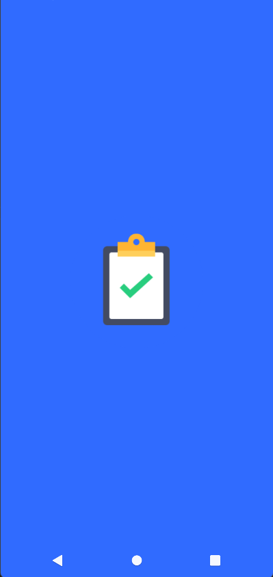
(Splash Screen da aplicação)
  
---

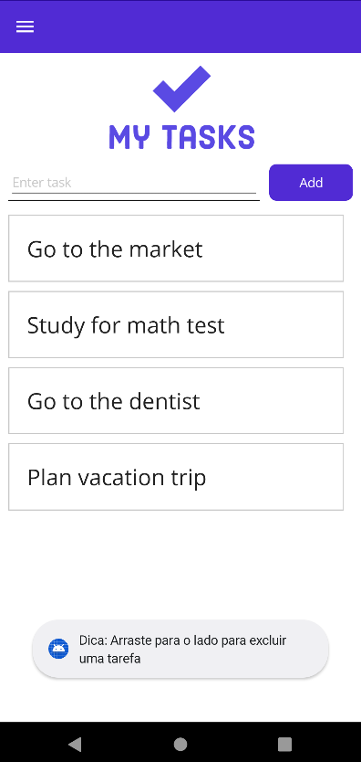
(Tela inicial da aplicação)

---

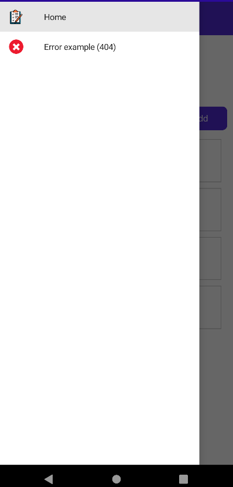

---

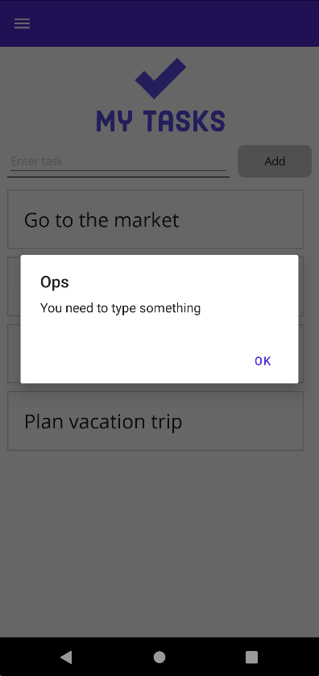
(Tela de erro ao tentar adicionar uma tarefa sem título)

---

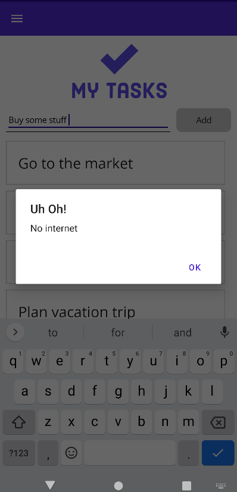
(Tela de erro ao tentar adicionar uma tarefa sem conexão com a internet)

---

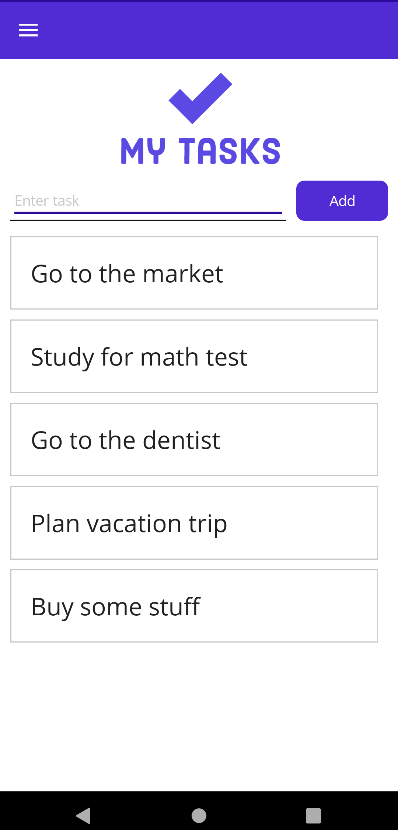
(Tarefa adicionada com sucesso)

---

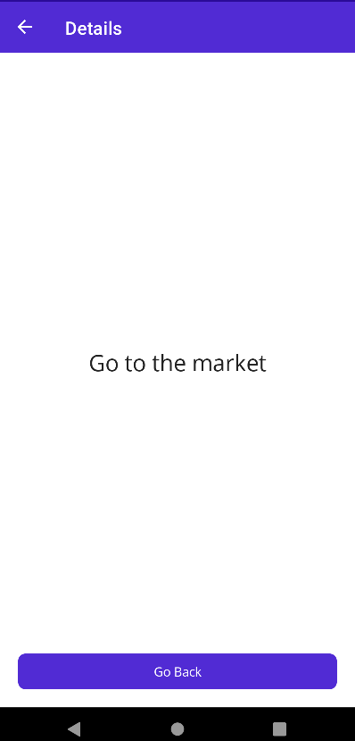
(Página de detalhes de uma tarefa)

---

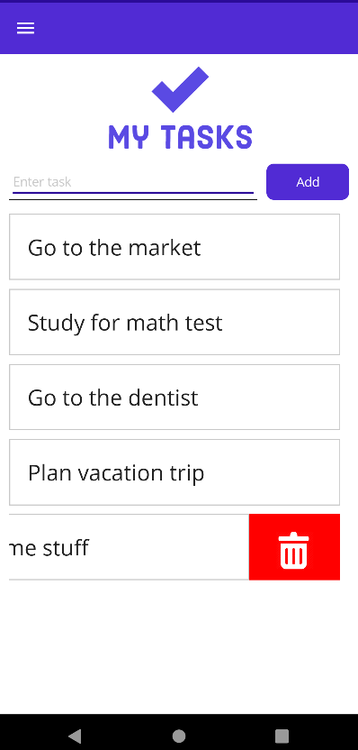
(Deslizar para deletar uma tarefa)

---

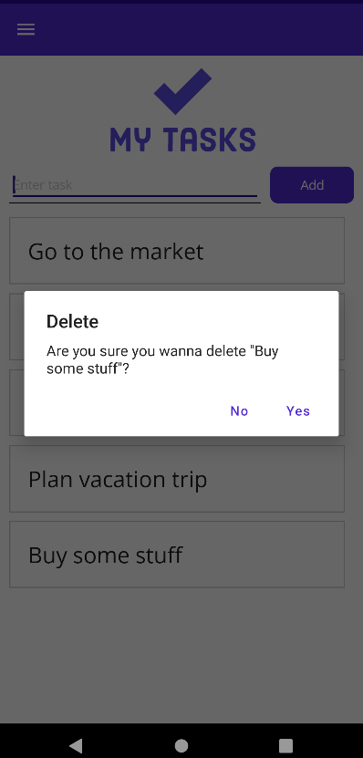
(Modal de confirmação para deletar uma tarefa)

---

| Mensagem de erro | Tela para nenhum registro |
| ---------------- | ------------------------- |
| 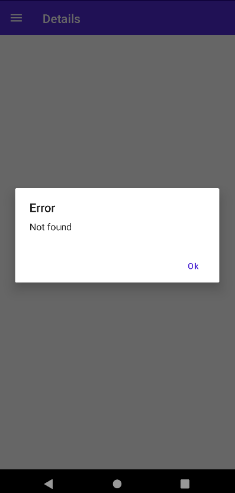 | 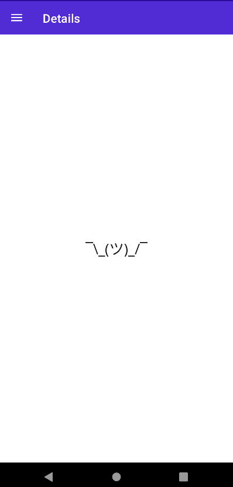 |

(Página de exemplo de erro (404), com a finalidade de testar o tratamento de erros ao tentar obter uma tarefa que não existe, reaproveitando a mesma página de detalhes)
