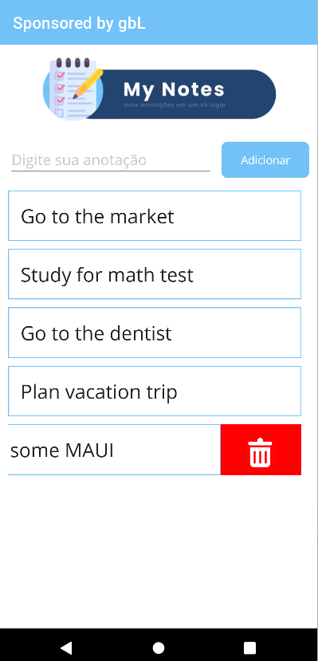

# Telas da aplicação na segunda versão (v2)

(Splash Screen da aplicação)
  
---

## Light Theme

(Tela inicial da aplicação)

---

(Página de detalhes de uma tarefa)

---

(Deslizar para deletar uma tarefa)

---

## Dark Theme

(Tela inicial da aplicação)

---

(Página de detalhes de uma tarefa)

---

(Deslizar para deletar uma tarefa)
